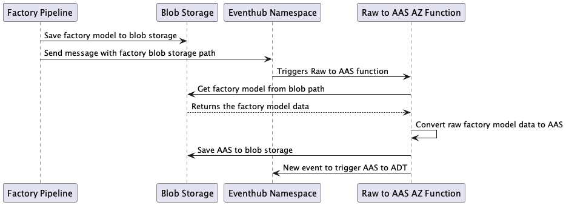

# Model Data Function Contracts <!-- omit in TOC -->

The model data functions are intended to maintain the state of the Digital Twin graph.
The data that will update the Digital Twin graph will come from a new pipeline run.
The process to turn the raw factory model data into a digital twins graph will go through two Azure functions.

There will be an AAS conversion Azure function and an AAS to Digital Twins Azure function.
These functions are intended to work sequentially to convert the raw data to Digital Twin graph.

## Table of Contents <!-- omit in TOC -->

- [Model Data Function Contracts ](#model-data-function-contracts-)
  - [Table of Contents ](#table-of-contents-)
  - [Raw to AAS Function](#raw-to-aas-function)
    - [Assumptions](#assumptions)
    - [Function Contracts](#function-contracts)
      - [EventHub Triggering Message](#eventhub-triggering-message)
        - [Event Body](#event-body)
        - [Event Properties](#event-properties)
    - [Other Event Data Properties](#other-event-data-properties)
      - [Input Blob Schema](#input-blob-schema)
      - [On Success Blob](#on-success-blob)
      - [On Success EventHub Message](#on-success-eventhub-message)

## Raw to AAS Function



This Azure function will convert the raw factory/factories model data into an AAS representation.
This document outlines the data contracts for this process.
There are a few assumptions currently on how this will be done.

### Assumptions

1. The raw data will be stored in Blob storage.
1. There will be a mapping service/object which will hold the ground truth that maps the raw factory properties to AAS properties.

### Function Contracts

#### EventHub Triggering Message

**After** the pipeline pushes the new factory data to blob storage, an event should be sent to Event Hub that specifies the location of the blob.
This blob will then be read, and the contents of the blob will be transformed to an AAS representation of the factory.
The message should adhere to a similar contract.

##### Event Body

```json
{
    "path": "<path to raw factory data>",
    "outputFileName": "<output file for converted AAS data>"
}
```

The event body of the Event Hub event will contain the following:

- **path:** the path to the file in blob storage.
- **outputFileName:** the desired output file name for converted AAS data

##### Event Properties

```json
{
    "type": "<type of event being processed>",
    "dateTime": "<utc date of processing>"
}
```

The event properties of the Event Hub event will contain the following:

- **type:** the type of object the message should deserialize to.
- **dateTime:** the date and time (in utc) which the event was sent.

These properties can be set using the `EventData` Properties property.

Example:

```c#
eventData.Properties["type"] = "some type";
```

### Other Event Data Properties

Out of the box, we get access to a few properties from the Event Data sent.
Those properties are:

- **CorrelationId:** we will use correlation id to correlate logs between the two function
- **PartitionKey:** this is the partition of Event Hub that was utilized
- **Namespace:** while we cannot get the namespace from the event data, we can add to the configuration of the function app.

#### Input Blob Schema

The expected raw factory data in blob storage will follow a defined schema.
An example of this structure is provided in [this file](../../samples/model-data/Factory.json) in the `samples/` directory of this repository.

#### On Success Blob

On successful conversion of raw to AAS, the Azure Function will save the model AAS representation to blob storage.
The schema for the blob can be found [here](./model-data-raw-to-aas.md).

#### On Success EventHub Message

On successful conversion and saving of the AAS model to blob storage,
an event should be sent to Event Hub with the same body and properties schema as the event that triggered the Raw to AAS function.

**Note:** The event should be sent **after** the upload of the file has completed successfully.
