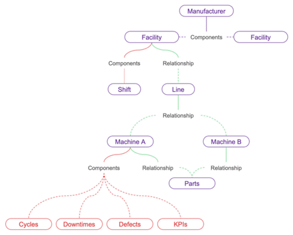
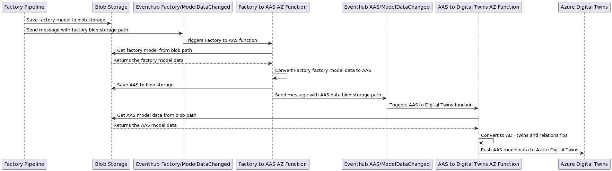
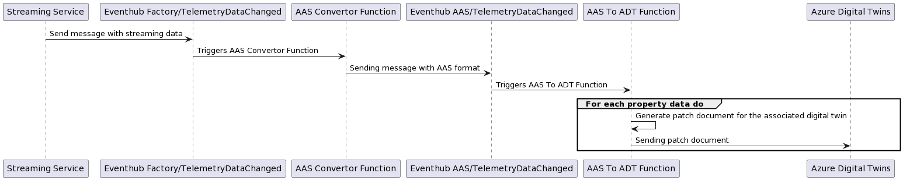

# Building Digital Twins using Industrie 4.0 AAS ontology

Digital Twins are virtual models of real-world entities, including places, business processes, and people, that can be created and managed using [Azure Digital Twins (ADT)](https://learn.microsoft.com/en-us/azure/digital-twins/).
Possibilities are immense when these models include real-time data with historization capabilities.
This post will walk you through a serverless solution that can be used to create digital twins for manufacturing data models, utilizing the [Asset Administration Shell (AAS) ontology](https://github.com/digitaltwinconsortium/ManufacturingOntologies/tree/main/Ontologies/AssetAdminShell).

The Industries 4.0 AAS ontology is an open standard for the exchange of information between partners in the manufacturing value chain.
It was specifically created to aid solution providers in speeding up the development of digital twin solutions for manufacturing applications, such as predictive maintenance, asset condition monitoring, OEE calculation, and simulation.
The authors of this [GitHub repository](https://github.com/digitaltwinconsortium/ManufacturingOntologies/tree/main/Ontologies/AssetAdminShell) have trialed the applicability of using AAS as a base for building an ontology for Smart Production (Discrete Manufacturing, Process Manufacturing and Automotive Production).

**Why AAS ontology to represent Digital Twins?**

1. Being a standard, it offers a shared foundation for modeling factories using industry-standard techniques, which reduces the need for reinvention.
1. Flexibility in modeling a manufacturing facility using pre-defined DTDL models. Traditionally what would become a DTDL model add/change followed by an update of the twin because of schema changes is now a simple twin update as the model is fixed.
1. A powerful key concept of the AAS metamodel is that all relevant information is provided by submodels. Submodels can refer to other submodels. This enables a high degree of independence from the entire supply chain in building and operating digital twins.

## Sample Scenario

Imagine a real-life scenario of `Contoso`, a delivery company that uses robots to pick products from a warehouse and prepare them for shipping.
The company has two facilities located in Seattle and Boston, each with a line of two robots that are of the same type and share common parts.

To keep track of the performance of the robots, they collect a vast amount of telemetry data, including operational data and key performance indicators, and send this information to the cloud. 
John, who works at Contoso, uses a dashboard to monitor the data and take action if there are any issues, such as downtime, to ensure timely delivery to customers.

Creating this connected system requires representing `Contoso's` current structure, including its two facilities, one line, two machines, and components, in a graph.



Our goal is to represent `Contoso's` current structure as digital twins. The process involves two main flows: model transformation and streaming data.
Firstly, the system will parse the representation of the factory graph and construct the digital twins.
Secondly, as operational data or key performance indicators are received, the digital twins will be updated accordingly.
Additionally, the user should have access to historical data to identify patterns.

### Architecture

Overall implementation of the solution is a serverless based architecture responsible for building the digital representation of a manufacturing factory in digital twins and updating the machines telemetry data near real-time for analysis; corresponding to the model transformation and streaming data flows respectively.

Both of these flows will be initiated through events in **Azure Event Hub**. Once initiated, each flow executes two sequential **Azure Functions**, one for AAS conversion and another for ADT conversion; which we'll cover later in this post.

The model transformation functions depends on **Azure Blob Storage** as part of their workflows, whereas both flows relies heavily on **Azure Digital Twins** during ADT conversion. **Azure Data Explorer** (ADX) is also part of the solution during streaming data flow.

A detailed architectural diagram that illustrates the individual components can be found [in the sample project documentation](./architecture.md)

### Factory Inputs

As part of the model transformation flow, here is an example factory as per `Contoso` data model represented as JSON:

```json
"factory": [
    {
      "id": "contoso",
      "modelType": "factory",
      "name": "contoso",
      "displayName": "Contoso",
      "placeName": "Washington, USA",
      "timezone": "PST",
      "machines": [
        {
          "id": "robot1",
          "name": "robot1"
        },
        ...
      ],
      "lines": [
        {
          "id": "line1",
          "name": "line1"
        },
        ...
      ]
    }
]
```

There are few things to call out here:

- Attributes that describe this factory object. For example, `id` represents the unique identifier, `name` represents the code name, `displayName` represents the friendly name and `placeName` represents the location.
- Attributes that defines relationships to other factory objects. For example, the machine object with id `robot1` has a relationship to the factory object `contoso`.

A full `Contoso` data model representation, which includes lines, machines, machine types and concept description, can be found in the [model data from the sample project](../samples/model-data/Factory.json).

In regards to the streaming data flow, there is only one model data dedicated for property updates of a particular machine.

Here is an example machine update as per `Contoso` data model represented as JSON:

```json
        {
          "header": {
            "machineId": "robot1",
            "modelType": "machineType"
          },
          "data": [
            {
                "id": "temperature",
                "name": "temperature",
                "dataType": "float64",
                "value": 12.34
            },
            {
                "id": "starttime",
                "name": "starttime",
                "dataType": "datetime",
                "value": "2023-02-02T18:00:00.000Z"
            },
            {
                "id": "endtime",
                "name": "endtime",
                "dataType": "datetime",
                "value": "2023-02-02T18:00:00.000Z"
            }
          ]
        }
```

We can observe the machine with id `robot1` sent one update for `temperature` property. The other properties `starttime` and `endtime` are required properties for historization purposes. Keep in mind that a machine update can include more than one property update.

Now let's try to understand the two processing flows in detail. Both the flows have one thing in common, both of them try to convert the factory provided data into common AAS format data and then move the data to Azure digital twin.

Let's first review how the AAS conversion is implemented.

### AAS Conversion

For AAS conversion, we use a list of mapping rules to translate the factory data to data based on Asset Administration Shell (AAS) metamodel.
This step is really important as it helps with converting custom factory data to predefined standard AAS models.

Let's try to understand by using sample code of the custom machine model and see how it is converted into standard AAS components: Submodels and Reference Elements. First, we will have to look at one of the mapping rule defined to transform custom models to standard AAS models. Let's uses this sample code [file](https://github.com/Azure-Samples/aas-digital-factory/blob/main/src/AasFactory.Azure.Functions.ModelDataFlow/Services/AasConverters/MachineConverter.cs) as reference. This piece of code does the necessary conversion to standard models.

Here is an example AAS machine as per `Contoso` data model represented as JSON:

```json
{
   "Id":"aas_m_robot1",
   "IdShort":"robot1",
   "DisplayName":{
      "LangString":{
         "EN":"Robot 1"
      }
   },
   "SubModels":[
      {
         "Id":"aas_sm_m_robot1_od",
         "IdShort":5,
         "DisplayName":{
            "LangString":{
               "EN":"OperationalData"
            }
         },
         "Properties":[
            {
               "DisplayName":{
                  "LangString":{
                     "EN":"Temperature"
                  }
               },
               "Id":"aas_sme_m_robot1_od_temperature",
               "IdShort":"temperature",
               "ValueType":4,
               "Value":"",
               ...
            },
            ...
         ],
         "ReferenceElements":[
         ],
      }
   ]
},
```

For every new custom onboarding the mapping rules implementation may change based on the definition of the incoming data but the underlying standard models definitions to which they will be transformed to will not have to change. It is also worth noting that POCO (Plain Old CLR Objects) classes have been defined for the AAS models definition.

Once we have tranformed the input data to a standard format, the data is ready to be represented in Azure digital twin. For digital representation, let's look at how ADT conversion works next.

### ADT Conversion

<div style="margin: auto; text-align: center; margin-top: 20px; margin-bottom: 20px;">
   <div>
      
   </div>
   <div>
      <i>The ADT representation of the Seattle Factory (1 line, 2 machines, 1 machine type).</i>
   </div>
</div>

The AAS format data is converted to DTDL specific format to be able to create azure digital twins and relationships. We have defined POCO classes here as well for the twins and relationships definitions in our implementation. You will notice that we have used Azure SDK for Azure digital twin interactions. Let's look at one of the sample code [snippet](https://github.com/Azure-Samples/aas-digital-factory/blob/main/src/AasFactory.Azure.Functions.ModelDataFlow/Services/ConceptDescriptionRepository.cs) that is used to first convert Concept Description to twins and relationships definitions and then create them. `Twins.ConceptDescription` and `Twins.DataSpecification` are the POCO classes defined for creating digital twins. `ConceptDescriptionToDataSpecification` and `ReferenceToConceptDescription` are the POCO classes defined for creating digital relationships.

[Here](https://github.com/Azure-Samples/aas-digital-factory/blob/main/src/AasFactory.Azure.Models/Adt/Twins/ConceptDescription.cs) is one of the ADT `Twins.ConceptDescription` POCO class definition for reference.

### Model and Streaming Flows

Based on the understanding we have so far on the AAS conversion and ADT conversion, let's now look at how all the information ties down to both the flows.

The purpose of `Model transformation flow` is to:

1. Ingest the definition of the factory, the hierarchy of the factory, and all the factory's assets
1. Convert the factory definition into an intermediate AAS representation.
1. Convert the intermediate AAS data into a graph on ADT using the AAS metamodels and properties.

Below diagram represents how the implementation is done in detail and the details of the function can be found [here](https://github.com/Azure-Samples/aas-digital-factory/blob/main/src/AasFactory.Azure.Functions.ModelDataFlow/README.md).



The purpose of `Streaming data flow` is to:

1. Ingest the new telemetry sample from the factory
1. Convert the telemetry sample into a pseudo-AAS object to
1. Update the necessary machine properties of the corresponding twin on the graph.

Below diagram represents how the implementation is done in detail and the details of the function can be found [here](https://github.com/Azure-Samples/aas-digital-factory/blob/main/src/AasFactory.Azure.Functions.StreamingDataFlow/README.md).



## Summary

The [github sample](https://github.com/Azure-Samples/aas-digital-factory) provides the code and deployment script for the described architecture. Although converting to AAS adds complexity, it provides an abstraction from the factory model updates.
