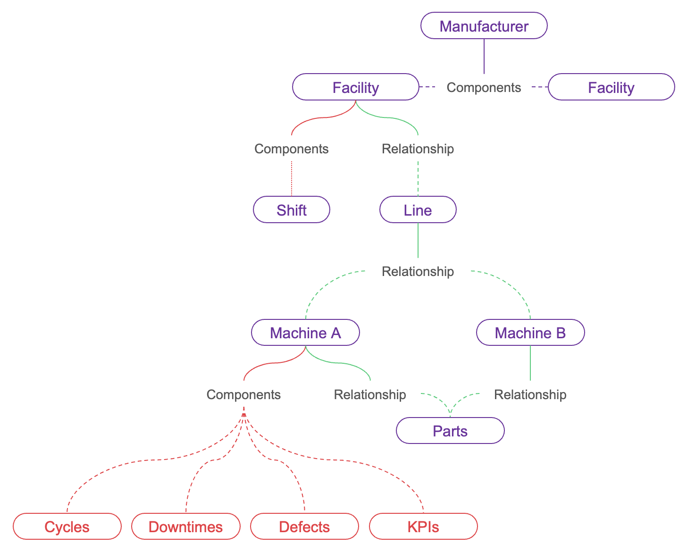
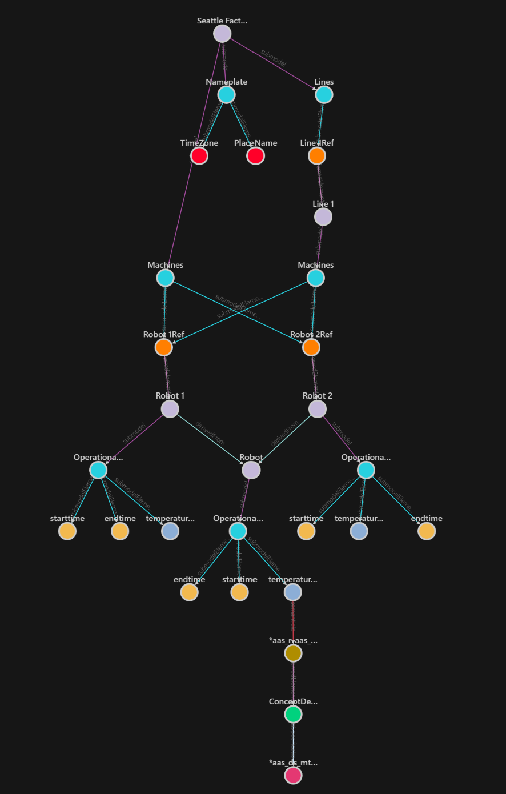

# Building Digital Twins using Industrie 4.0 AAS ontology

## Introduction

Digital Twins are virtual models of real-world entities, including places, business processes, and people, that can be created and managed using [Azure Digital Twins (ADT)](https://learn.microsoft.com/en-us/azure/digital-twins/).
Possibilities are immense when these models include real-time data with historization capabilities.
This post will walk you through a serverless solution that can be used to create digital twins for manufacturing data models, utilizing the [Asset Administration Shell (AAS) ontology](https://github.com/digitaltwinconsortium/ManufacturingOntologies/tree/main/Ontologies/AssetAdminShell).

The Industries 4.0 AAS ontology is an open standard for the exchange of information between partners in the manufacturing value chain.
It was specifically created to aid solution providers in speeding up the development of digital twin solutions for manufacturing applications, such as predictive maintenance, asset condition monitoring, OEE calculation, and simulation.
The authors of this [GitHub repository](https://github.com/digitaltwinconsortium/ManufacturingOntologies/tree/main/Ontologies/AssetAdminShell) have trialed the applicability of using AAS as a base for building an ontology for Smart Production (Discrete Manufacturing, Process Manufacturing and Automotive Production).

**Why AAS ontology to represent Digital Twins?**

1. Being a standard, it offers a shared foundation for modeling factories using industry-standard techniques, which reduces the need for reinvention.
1. Flexibility in modeling a manufacturing facility using pre-defined [DTDL models](https://learn.microsoft.com/en-us/azure/digital-twins/concepts-models#digital-twin-definition-language-dtdl-for-models). Traditionally what would become a DTDL model add/change followed by an update of the twin because of schema changes is now a simple twin update as the model is fixed.
1. A powerful key concept of the AAS metamodel is that all relevant information is provided by submodels. Submodels can refer to other submodels. This enables a high degree of independence from the entire supply chain in building and operating digital twins.

### Sample Scenario

Imagine a real-life scenario of `Contoso`, a delivery company that uses robots to pick products from a warehouse and prepare them for shipping.
The company has two facilities located in Seattle and Boston, each with a line of two robots that are of the same type and share common parts.

To keep track of the performance of the robots, they collect a vast amount of telemetry data, including operational data and key performance indicators, and send this information to the cloud.
John, who works at Contoso, uses a dashboard to monitor the data and take action if there are any issues, such as downtime, to ensure timely delivery to customers.

Creating this connected system requires representing `Contoso's` current structure, including its two facilities, one line, two machines, and components, in a graph.

<div style="margin: auto; text-align: center; margin-top: 20px; margin-bottom: 20px;">
   <div>
      
   </div>
   <div>
      <i>Contoso's ontology.</i>
   </div>
</div>

Our goal is to represent `Contoso's` current structure as digital twins. The process involves two main flows: model transformation and streaming data.
Firstly, the system will parse the representation of the factory graph and construct the digital twins.
Secondly, as operational data or key performance indicators are received, the digital twins will be updated accordingly.
Additionally, the user should have access to historical data to identify patterns.

## Architecture

Overall implementation of the solution is a serverless architecture responsible for building the digital representation of a manufacturing factory in digital twins and updating the machines' telemetry data near real-time for analysis; corresponding to the model transformation and streaming data flows respectively.

Both of these flows will be initiated through events in **Azure Event Hub**. Once initiated, each flow executes two sequential **Azure Functions**, one for AAS conversion and another for ADT conversion; which we'll cover later in this post. The model transformation functions depends on **Azure Blob Storage** as part of their workflows. **Azure Data Explorer** (ADX) is part of the solution of the streaming data flow to record the updates to the twins.

A detailed explanation of the architecture and the reasoning behind the choice of resources used can be found [in the sample project documentation](./architecture.md)

### Factory Inputs

As part of the model transformation flow, here is an example factory as per `Contoso` data model represented as JSON:

```json
"factory": [
    {
      "id": "contoso",
      "modelType": "factory",
      "name": "contoso",
      "displayName": "Contoso",
      "placeName": "Washington, USA",
      "timezone": "PST",
      "machines": [
        {
          "id": "robot1",
          "name": "robot1"
        },
        ...
      ],
      "lines": [
        {
          "id": "line1",
          "name": "line1"
        },
        ...
      ]
    }
]
```

There are few things to call out here:

- Attributes that describe the factory object. For example, `id` represents the unique identifier, `name` represents the code name, `displayName` represents the friendly name and `placeName` represents the location.
- Attributes that define relationships to other factory objects. For example, the machine object with id `robot1` has a relationship to the factory object `contoso`.

A full `Contoso` data model representation, which includes lines, machines, machine types and concept description, can be found in the [model data from the sample project](../samples/model-data/Factory.json).

In regards to the streaming data flow, there is only one model data dedicated for property updates of a particular machine.

Here is an example machine update as per `Contoso` data model represented as JSON:

```json
        {
          "header": {
            "machineId": "robot1",
            "modelType": "machineType"
          },
          "data": [
            {
                "id": "temperature",
                "name": "temperature",
                "dataType": "float64",
                "value": 12.34
            },
            {
                "id": "starttime",
                "name": "starttime",
                "dataType": "datetime",
                "value": "2023-02-02T18:00:00.000Z"
            },
            {
                "id": "endtime",
                "name": "endtime",
                "dataType": "datetime",
                "value": "2023-02-02T18:00:00.000Z"
            }
          ]
        }
```

We can observe the machine with id `robot1` sent one update for `temperature` property. The other properties `starttime` and `endtime` are required properties for historization purposes. Keep in mind that a machine update can include more than one property update.

Now let's try to understand the two processing flows in detail. Both the flows have one thing in common, both of them try to convert the factory provided data into common AAS format data and then move the data to Azure digital twin.

Let's first review how the AAS conversion is implemented.

### AAS Conversion

For AAS conversion, we use a list of mapping rules to translate the factory data to data based on Asset Administration Shell (AAS) metamodel.
This step is really important as it helps with converting custom factory data to predefined standard AAS models.

Let's try to understand by using sample code of the custom machine model and see how it is converted into standard AAS components: Submodels and Reference Elements. First, we will have to look at one of the mapping rule defined to transform custom models to standard AAS models. Let's use this sample code [file](https://github.com/Azure-Samples/aas-digital-factory/blob/main/src/AasFactory.Azure.Functions.ModelDataFlow/Services/AasConverters/MachineConverter.cs) as reference. This piece of code does the necessary conversion to standard models.

Here is an example AAS machine as per `Contoso` data model represented as JSON:

```json
{
   "Id":"aas_m_robot1",
   "IdShort":"robot1",
   "DisplayName":{
      "LangString":{
         "EN":"Robot 1"
      }
   },
   "SubModels":[
      {
         "Id":"aas_sm_m_robot1_od",
         "IdShort":5,
         "DisplayName":{
            "LangString":{
               "EN":"OperationalData"
            }
         },
         "Properties":[
            {
               "DisplayName":{
                  "LangString":{
                     "EN":"Temperature"
                  }
               },
               "Id":"aas_sme_m_robot1_od_temperature",
               "IdShort":"temperature",
               "ValueType":4,
               "Value":"",
               ...
            },
            ...
         ],
         "ReferenceElements":[
         ],
      }
   ]
},
```

For every new data model onboarding, the mapping rules implementation may change based on the definition of the incoming data but the underlying standard models definitions to which they will be transformed to will not have to change. It is also worth noting that POCO (Plain Old CLR Objects) classes have been defined for the AAS models definition.

Once we have tranformed the input data to a standard format, the data is ready to be represented in Azure digital twin. For digital representation, let's look at how ADT conversion works next.

### ADT Conversion

<div style="margin: auto; text-align: center; margin-top: 20px; margin-bottom: 20px;">
   <div>
      
   </div>
   <div>
      <i>The ADT representation of the Seattle Factory (1 line, 2 machines, 1 machine type).</i>
   </div>
</div>

The AAS factory data is converted to DTDL specific format to be able to create digital twins and relationships on ADT. These DTDLs are pre-defined in the [Asset Administration Shell (AAS) ontology](https://github.com/digitaltwinconsortium/ManufacturingOntologies/tree/main/Ontologies/AssetAdminShell).

Based on the ADT representation above, you can observe by colors that:

- violet nodes are DTDL AAS. This corresponds to the shell header of each AAS factory data; such as factory, line, machine and machine type.
- aqua nodes are DTDL Submodels. A DTDL AAS can contain multiple submodels. For example, the AAS Factory (Seattle's Factory) has three submodels to access information about the Nameplate, Machines and Lines.
- sky blue, yellow and red nodes are Properties (representing different data types). A DTDL Property describe a property value. Useful for storing telemetry data. For example, the Submodel OperationalData (of each Robot) reports temperature data.

To accomplish this result, we encourage using the Azure SDK for Azure Digital Twins interactions. We suggest start creating POCO classes here as well for the AAS twins and relationships definitions in the implementation. As an example, here is of the [ADT Submodel Twin POCO class definition](https://github.com/Azure-Samples/aas-digital-factory/blob/main/src/AasFactory.Azure.Models/Adt/Twins/Submodel.cs#L12).

Now that the POCO classes for AAS twins and relationships are defined, you need to implement the logic to map the AAS represention into the ADT representation. For that, you need to traverse all your AAS factory data from top (Shell) to bottom (Properties). For example, create first the twin for DTDL AAS, then create twins the DTDL submodels that are connected, and finally create the relationships between these DTDL AAS and Submodels. This [code snippet](https://github.com/Azure-Samples/aas-digital-factory/blob/main/src/AasFactory.Azure.Functions.ModelDataFlow/Services/ShellRepository.cs#L27-L47) describes what we just talked about.

## Summary

AAS is a standard developed by the Industrial Internet Consortium (IIC) for describing the assets in an industrial system. Azure Digital Twins is a platform that allows you to model, analyze, and monitor digital representations of physical environments, such as buildings, factories, and cities.

We can use the AAS standard as a meta model in ADT to model the assets within ADT, such as machines, equipment, and devices. By doing so, you can provide a standardized way of describing the assets, which can help to simplify integration with other systems without dealing with defining models.

We can use the AAS meta model to create a digital twin model of an asset that includes its physical characteristics, such as its location, dimensions, and components, as well as its functional characteristics, such as its capabilities and operational parameters. We can utilize AAS to monitor the performance of assets within the digital twin environment, such as measuring their energy consumption, temperature, and other key indicators that can be represented by AAS standard submodels. We may also use AAS standard to represent schedule and track maintenance activities for assets within ADT, such as conducting inspections, replacing parts, and performing repairs. Overall, using AAS in Azure Digital Twins can help us to create a more comprehensive and interoperable digital twin environment that can support a wide range of industrial applications.

In the proposed architecture, we can encapsulate the complexity of converting a factory data model to AAS
by adding a logical layer on top of ADT to handle the AAS request and encapsulate the complexity of AAS from top layer.  

The [github sample](https://github.com/Azure-Samples/aas-digital-factory) provides the code and deployment script for the described architecture.
